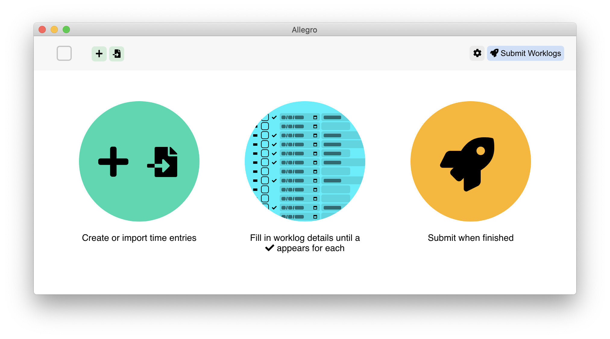
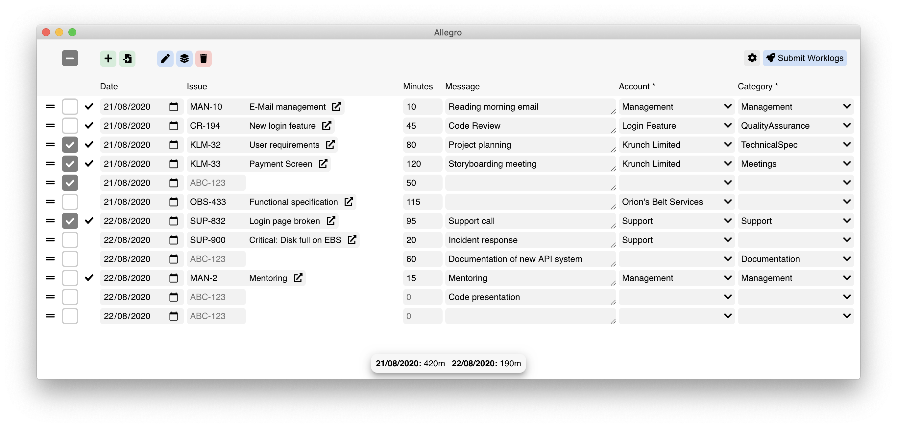

Submit worklogs to Tempo.io in batches.

Tempo.io currently has no ability to import worklogs/time logs from time tracking software like [Toggl](https://www.toggl.com/) or [Tyme](https://www.tyme-app.com/).
This is unfortunate for users like myself that tend to log dozens of different tasks in a day.
Manually keying in the entries into Tempo.io is an awful experience because every click takes a second or two to process.

**Allegro** makes the experience of logging time more bearable, speeding up a lot of the workflow by:

* Making all worklogs editable in a single view before submitting to Tempo.io.
* Easy importing of time logs from CSV files. 
* Showing a "total minutes" to keep track of accidental overtime (or "under"-time).
* Caching network requests.

**Important:**
This program is not created by Tempo.io.
This is just a tool created by a user of Tempo.io to help with importing large batches of worklogs.

## Screenshots




## Project setup
```
npm ci
```

(`npm install` will install newer versions of `electron` and `spectron` which don't work seem to work for some reason)

### Compiles and hot-reloads for development
```
npm run serve
```

### Compiles and minifies for production
```
npm run build
```

### Run your unit + integration (Spectron) tests
```
npm run test
```

### Lints and fixes files
```
npm run lint
```
